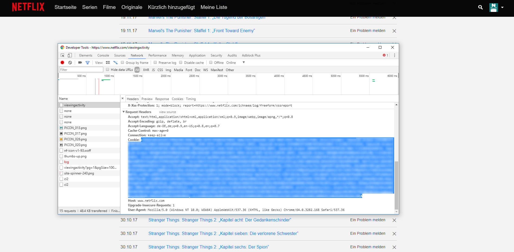
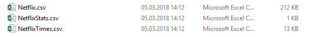
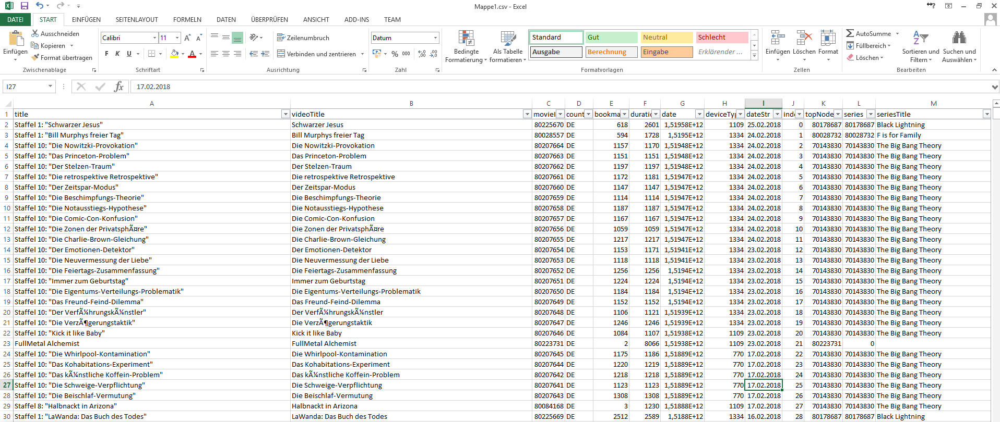
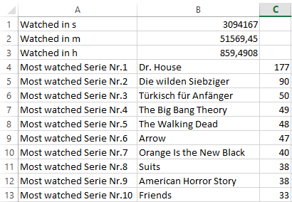
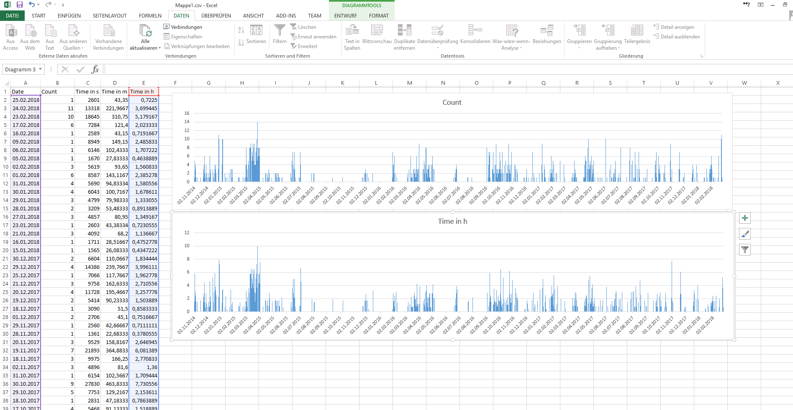

# Netflix Personal Statistics

This C# program uses the Netflix background API from the [Viewingactivity](https://www.netflix.com/viewingactivity) site to get more information.

# Usage

Next to the executable must be a folder with one or more .txt files. These files have to contain the Netflix cookie for the specific user.

An easy way to get the cookie is with Chrome. Just open these URL (https://www.netflix.com/viewingactivity) with the open Developer Tools (F12 or Ctr+Shift+I) and look under **Network**->**viewingactivity**->**Headers**->**Request Headers**->**Cookie:**.

Copy the cookie from begin to end in an empty text file and place it in the cookie folder next to the Executable. Start the program and after it closed automatically, you should have a new folder with 3 .csv files.

# CSV

The csv files can easily be viewed with Excel.

File | Description 
--- | --- 
|Netflix.csv|Contains all information the API will give us. With some Excel Filters, this can easily give more information
|NetflixStats.csv|A shourt summary with the Total Play time and the top 10 personal watched series
|NetflixTimes.csv|Summary for each Day with number of things watched and summed up time. You can easily use the Date and one of the other columns to make some graphs

# More

The NetflixStats.csv has only a small collection of stats and can easily be extended. Feel free to change the code.
